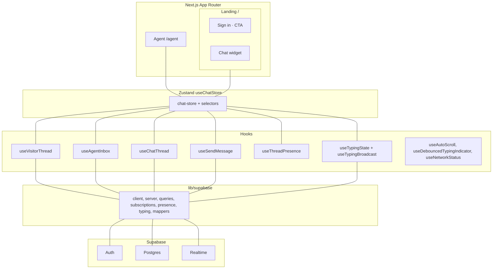

# MiniCom

A real-time support chat built with Next.js and Supabase. Visitors get a chat widget; agents use an inbox to handle conversations. Messages, presence, and typing are synced via Supabase Realtime.

## Project overview

- **Visitor side**: Floating chat launcher and widget. Visitor identity is lightweight (stored locally); no sign-up required. Messages and typing are sent over Realtime.
- **Agent side**: Inbox at `/agent` with thread list, thread view, presence indicators, unread counts, and real-time message/typing updates. Authentication required (demo account credentials are prefilled).
- **Stack**: Next.js (App Router), Supabase (Postgres + Realtime), Zustand, Tailwind, Shadcn UI.

## Architecture

## State management: why Zustand

One global store fits this app: both the visitor widget and the agent inbox need the same data (threads, messages, presence, typing). A single source of truth avoids syncing two UIs and keeps Realtime subscription updates in one place. No provider nesting and no need for a separate async/query layer - hooks talk to Supabase and write into the store. Selectors in `store/selectors.ts` keep components independent of the raw state shape.

## How AI helped

First, I used ChatGPT for writing a specification which I carefully reviewed and edited. I discussed with it to point out potential pitfalls and shape it according to my needs. Then Cursor was used for implementation, guidance, planning, refactors, and tooling. I mostly reviewed the code, suggested edits an manually updated the details. 

Example prompts and the kinds of edits they led to:

| Prompt (summary) | What was done |
|------------------|----------------|
| "Define a testing strategy and add tests: one for a UI interaction (submit on Enter in the composer), one for a store transition (upsertMessage for a new thread), and one for selector edge cases (merged messages, unread count)" | Vitest + Testing Library: tests for Enter in `MessageComposer`, `upsertMessage` for new thread, and selector edge cases in `tests/edge-case.test.ts`. |
| "Presence is laggy and unreliable. Reimplement Supabase presence so we use join/leave event payloads to update state, not polling; add a heartbeat and remove any legacy presence helpers" | Reworked `lib/supabase/presence.ts`: `subscribeToThreadPresence` using join/leave event payloads, handlers before `subscribe()`, heartbeat; removed legacy presence helpers. |
| "Add a ci safe typecheck as a script. exclude ignored and generated files from tsconfig" | `typecheck` script and `tsconfig.typecheck.json` excluding `.next`. |

## Improvements with more time

- **Tests**: More coverage (selectors with more edge cases, integration tests for hooks and store, E2E for critical flows).
- **Presence**: Stricter handling of reconnects and duplicate tabs.
- **Errors and resilience**: Error boundaries around chat widget and agent inbox; retry/backoff for Realtime and key mutations; clearer offline/error states in the UI.
- **Product**: Read receipts, typing debounce tuning, welcome message, "agent assigned" mesasge etc.

